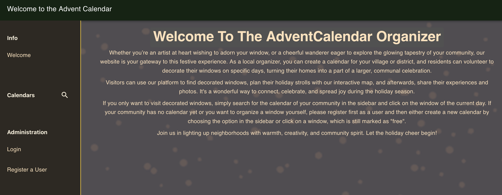

The repo:
```bash
git clone https://github.com/MrCode97/adventCalender.git
```

Frontend:
```bash
cd adventCalender/frontend
npm install     # install dependencies
npm start       # run
```

Backend:
```bash
cd adventCalender/backend
npm install     # install dependencies
export $(cat .env | xargs) # export env variables
node index.js   # run
```
```bash
Get-Content .env | ForEach-Object { [System.Environment]::SetEnvironmentVariable($_.Split('=')[0], $_.Split('=')[1], [System.EnvironmentVariableTarget]::Process) } # instead of export when using Windows
```


DB:
```bash
cd adventCalender/backend
docker build -t advent_db .
# Hit Ctrl-C to stop. Note the `--rm` flag to remove volume on close
docker run --rm -p 5432:5432 --name adventCal advent_db
```
